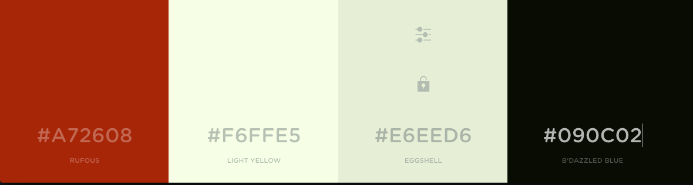
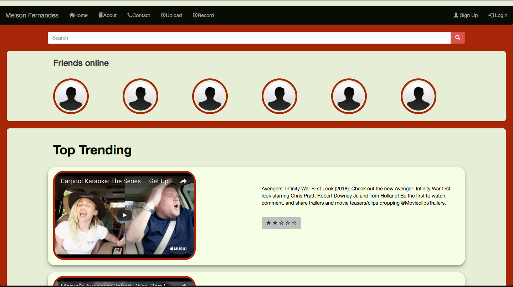

 

#personalWebsite

In this project, my Objective was to create a Reposnsive HTML website using Bootstrap. In this section, you will find a break down of the whole project, approcahes I made and the final outcome of the product.

#### Tasks:

- [Wireframe](#wireFrame)
- [Color-Scheme](#colorScheme)
- [Bootstrap](#bootStrap)
- [Build HTML](#buildHTML)
- [Screen-Shots](#screenShots)

##wireFrame
Creating a wireframe before building the HTML is very benifical. The wireframe it self is a blueprint of your website and allows you to see what it should look like before hand.

##colorScheme

The color scheme choosen for this HTML was very eye catching, bright yet smooth, this was done to intrigue the user and for a professoinal fishish.

##bootStrap

BootStrap framework was used to create this HTML. The framework works with grids which allows me to align any componets on the screen accurately. It also allows the HTML to be reponsive to any screen sizes.

##buildHTML

The process of building the HTML was not that complicated yet the porcess was long. Building the structure correctly was vital, as it works with grids I had to cacluate the exact amount of sizes each components needed in the rows and coloums, depending on the screen sizes.

##screenShots

Screen shots of my final product with different screen sizes and that they are Responsive:

####xs - Mobile phones

 

####sm - Tablets

####md - Desktop

######Melson Fernandes
